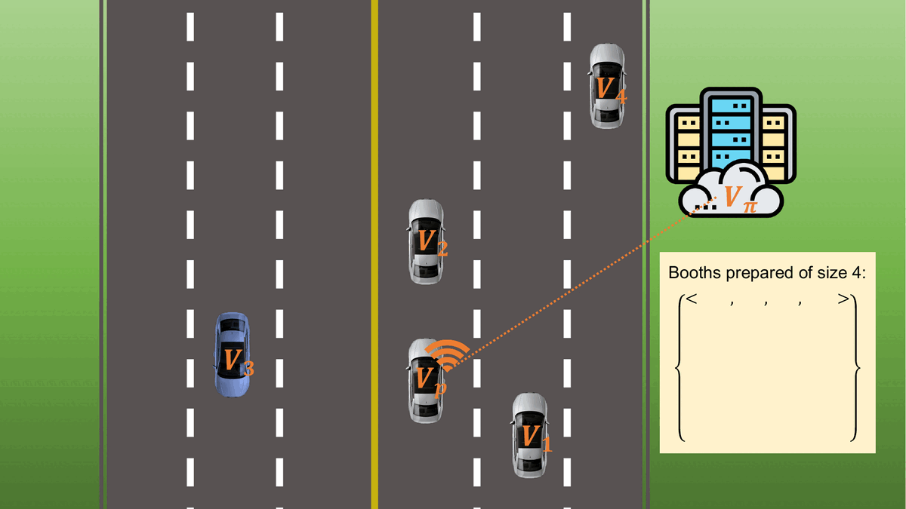
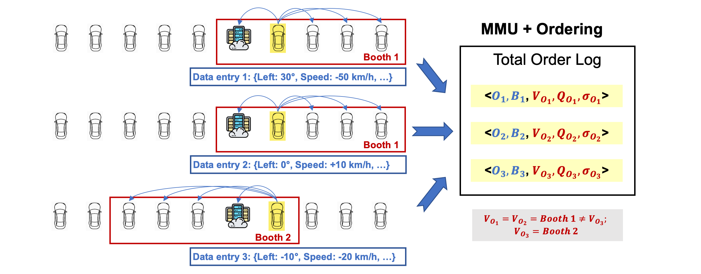
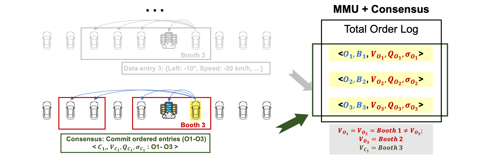

<h1 align="center"> V-Guard: An Efficient Permissioned Blockchain for Achieving Consensus under Dynamic Memberships in V2X Networks </h1>

## About V-Guard

V-Guard achieves high performance operating under dynamically changing memberships, targeting the problem of vehicles' arbitrary connectivity on the roads. When dealing with membership changes, BFT algorithms must stop any ongoing consensus process to update their system configuration. Traditional BFT algorithms (e.g., PBFT and HotStuff) were not designed for tackling frequent membership changes; they apply additional approaches to update system configurations and suffer from severe performance degradation.

In contrast, V-Guard integrates the consensus of agreeing on membership changes into the consensus of data transactions. More intuitively, tradition BFT algorithms achieve only data consensus, whereas V-Guard achieves a combination of data consensus and membership consensus.

    # Consensus target of tradition BFT algorithms: <data transactions>
    # Consensus target of V-Guard: <data transactions, membership profiles>

The integration makes V-Guard achieve consensus seamlessly with changing members (e.g., joining or leaving vehicles) and produces an immutable ledger recording traceable data with their residing membership profiles.

### Features and Use Cases
#### Membership Management Unit (MMU)
V-Guard is lightweight. Each vehicle creates its own V-Guard instance and runs as proposer. A V-Guard instance contains a Membership Management Unit (MMU), which keeps track of available vehicle connections and manages them into sets of membership profiles. The MMU describes a membership profile that contains a set of vehicles as a **booth**. The management of booths with a size of four is illustrated below.

### A use case example
In below example, the yellow car is the proposer, and the MMU is managing 10 members.
The consensus is composed of two segments: data (in blue font) and membership (in red font), where O is the orderingID (sequence #), B is the data batch, V is the booth, Q is the quorum, and Sigma is threshold signature.

Ordering instances can take place in different booths. E.g., when the proposer conducts consensus for data entry 1 (with operating information), the ordering takes place in Booth 1. When Booth 1 is still available, the next ordering instance can share the same booth (data entry 2). However, when Booth 1 is no longer available (e.g., some vehicles go offline), the MMU will provide a new booth (e.g., Booth 3) for a new ordering instance.

Consensus instances are executed periodically. They operate as "shuttle buses" with a sole purpose of committing the entries appended on the total order log by ordering instances. A consensus instance can operate in a different booth from ordering instances, where the new members will scrutinize the previously collected signatures of the entries if they have not participated in the ordering of these entries.

## Try the Current Version

### Install dependencies
GoLang should have been properly installed with `GOPATH` and `GOROOT`. The GoLang version should be at least `go1.17.6`. In addition, three external packages were used (check out `go.mod`).

    # threshold signatures
    go get go.dedis.ch/kyber
    # logging
    go get github.com/sirupsen/logrus
    # some math packages
    go get gonum.org/v1/gonum/

### Run V-Guard instances locally
Below shows an example of running a V-Guard instance with a booth size of 4 with 6 initial available connections.
The quorum size of booths (of size 4) is 3, and threshold is set to 2, as the proposer is always included.
    
    // We assume the folder containing the downloaded code is called "vguardbft"
    // First move the key generator outside of the V-Guard package.
    mv -r keyGen ../
    
    // Then, go to the keyGen folder to generate keys
    cd ../keyGen
    go build generator.go
    
    // generator produces private and public keys for threshold signatures
    // where t is the threshold and n is the number of participants
    ./generator -t=2 -n=6
    
    // A "key" folder should be generated with 6 private keys and 1 public key
    // Privates keys: pri_#id.dupe
    // Public key: vguard_pub.dupe
    // Now move the key folder to the VGuard folder
    cp -r key ../vguardbft/
    
    // Compile the code in "vguardbft"
    cd ../vguardbft
    ./scripts/build.sh
    
    // Now we can run a V-Guard instance
    // First, run the proposer; a proposer always has the ID of 0
    // The script takes two parameters: $1=ServerID; $2= role (leader: 0; validator: 1)
    ./scripts/run.sh 0 0 // this starts a proposer

    # run validators
    ./scripts/run.sh 1 1 // this starts a validator whose ServerID=1
    ./scripts/run.sh 2 1
    ./scripts/run.sh 3 1

Check out file `parameters.go` for further parameters tuning.

## Deployment on clusters
The project is under a double-blind review process. We temporarily redacted the deployment details to preserve anonymity.
